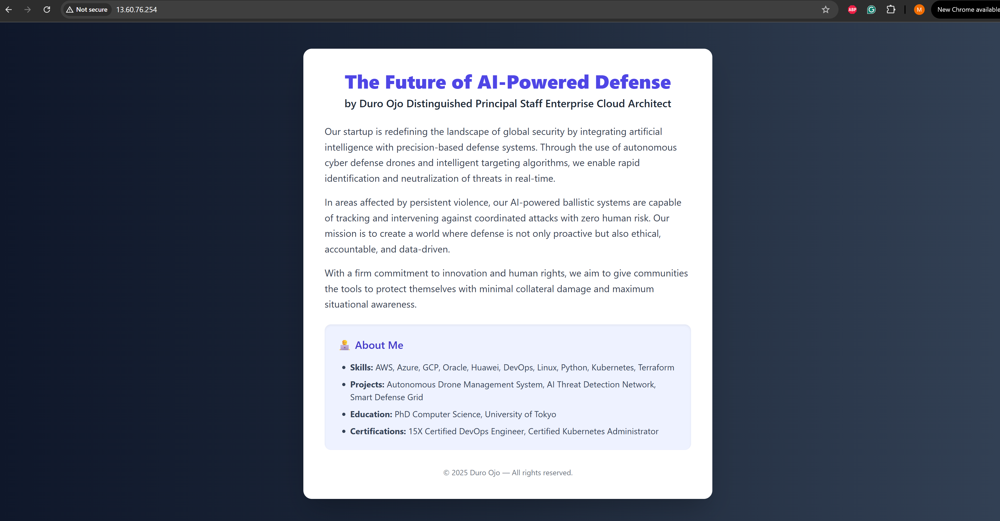

Landing Page – The Future of AI Powered Defense

Summary
This is a landing page hosted on an EC2 instance using Nginx. It includes basic styling, highlights my background, and pitches our innovative startup idea.

Steps Taken

Cloud Provisioning
- Launched AWS EC2 Ubuntu 22.04 instance
- Allowed SSH (22), HTTP (80), HTTPS (443)

Web Server Setup
- Installed Nginx
- Deployed HTML

Landing Page Features
- Project Title, Role, Bio
Basic styling and layout

Deployment & Security
- Hosted via public IP: `http://13.60.76.254/`

